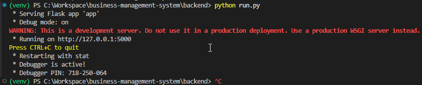

# business-management-system 🍕
Um sistema web para gerenciar vendas de uma pizzaria, incluindo controle de clientes, produtos e pedidos.

## Tecnologias Utilizadas
- **Back-End:** Flask (Python)
- **Front-End:** React + Tailwind CSS
- **Banco de Dados:** PostgreSQL
- **Hospedagem:** Nuvem gratuita (Render, Fly.io, ou PythonAnywhere)

## Funcionalidades
- CRUD de clientes.
- CRUD de produtos.
- CRUD de pedidos no balcão e na mesa.
- Compatível com PC e smartphones (PWA).

## Como Executar Localmente
### Pré-requisitos
- Python 3.9+
- Node.js 16+
- PostgreSQL

### Passos
1. Clone o repositório:
   ```bash
   cd /c/Workspace
   git clone https://github.com/seu-usuario/pizzaria-system.git

2. Baixe alterações do repositótio:
   git pull                     # Baixa e mescla alterações
   git fetch                    # Baixa sem mesclar
   
3. Verifica se SSH Key está válida:
   git remote -v                # Verifica se existe SSH Key cadastrada no path
   cat ~/.ssh/id_ed25519.pub    # Exibe a SSH Key
   ssh -T git@github.com        # Verifica se a conexão foi fechada entre PC e GitHub
   https://github.com/settings/keys

4. Suba alterações no GitHub:
   cd /c/Workspace/business-management-system
   git status
   git add .
   git commit -m "message"
   git push

## Configuração do ambiente de DEV
   1. Baixar as ferramentas necessárias:
      * Node.js 16+ --> v24.16.0 LTS
      * npm         --> v11.13.0
      * Python 3.9+ --> 
      * PostgreSQL
      * DBeaver

   2. Configuração completa do backend
      * Acessar terminal via VS Code
      * Rodar comando:
        cd C:\Workspace\business-management-system\backend\
      * Rodar os seguintes comandos no Terminal VS Code:
         - ✅ python -m venv venv
         - ✅ venv\Scripts\activate
         - ✅ pip install flask flask-cors flask-sqlalchemy psycopg2-binary
         - ✅ pip freeze > requirements.txt
         - ✅ pip install -r requirements.txt
         - ✅ python run.py --> Inicialização do servidor de Python 
               

   3. Configuração completa do frontend
      * Acessar terminal via VS Code
      * Rodar comando:
        cd C:\Workspace\business-management-system\
      * Rodar os seguintes comandos no Terminal VS Code:
         - ✅ node -v                                           # Verifica a versão do Node.js
         - ✅ npm -v                                            # Verifica a versão do NPM
         - ✅ npx create-react-app frontend                     # Cria a pasta /front-end
         - ✅ cd C:\Workspace\business-management-system\frontend\
         - ✅ npm install                                       # Instala o npm
         - ✅ npm install -D tailwindcss@3 postcss autoprefixer # Instala o Tailwind CSS
         - ✅ npx tailwindcss init -p                           # Instala o Tailwind CSS
         - ✅ npm install web-vitals                            # Instala o Web Vitals
         - ✅ npm install axios                                 # Instala o Axios
         - ✅ npm install react-router-dom                      # instala o router para habilitar múltiplas telas
         - ✅ tailwind.config.js                                # Configura Tailwind CSS diretamente no arquivo .js
         - ✅ src/index.css                                     # Configura CSS diretamento no arquivo .css
         - ✅ src/App.js                                        # Testa Tailwind diretamente no arquivo .js
         - ✅ npm init -y                                       # Descreve as versões de todas as dependências instaladas
         - ✅ npm start --> Inicialização do servidor de React

   4. Configuração completa do database
      * ✅ Acessar o DBeaver
      * ✅ Criar conexão com PostgreSQL
      * ✅ Salvar credenciais da conexão: Host, port, username, password
      * ✅ Habilitar flag na conexão criada: Exibir todos os bancos de dados
      * ✅ Criar banco de dados
      * Configurar flask para utilizar o banco de dados:
         - ✅ Acessar o VS Code
         - ✅ \backend\app\__init__.py                          #Configura credenciais SQLALCHEMY_DATABASE_URI e SECRET_KEY 
         - ✅ \backend\config.py                                #Configura credenciais SQLALCHEMY_DATABASE_URI e SECRET_KEY 
         - ✅ python run.py --> Inicialização do servidor de Python
      
      A partir dessa configuração, o fluxo ideal para criar estruturas no database é:
      - React → Axios → API Flask → Flask → SQLAlchemy → PostgreSQL

## Como rodar o projeto no localhost
   1. Acesse o terminal via VS Code
   2. Rode: cd C:\Workspace\business-management-system\backend\
   3. Rode: python run.py
   4. Abra uma 2ª aba do terminal via VS Code
   5. Rode: cd C:\Workspace\business-management-system\frontend\
   6. Rode: npm start
   Obs: Dessa forma, é inicializado o servidor back-end e o front-end. Além disso, vale a pena abrir o DBeaver e o Postman.